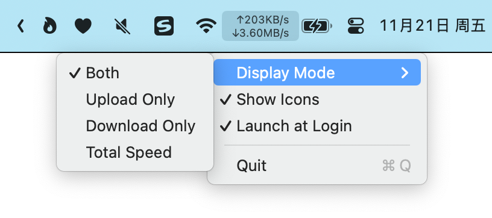

# NetSpeed

[🇨🇳 中文](README.md) | 🇬🇧 English

Lightweight yet powerful macOS menu-bar network monitor with dynamic refresh rate, login-item support and multiple display modes.

## 👀 Preview



## ✨ Highlights
- **Live throughput** Up/down speed for the primary interface, auto-scaling units (B/s, KB/s, MB/s)
- **Adaptive refresh** 0.5 s when ≥ 1 MB/s, 1 s otherwise
- **Icon toggle** Optional arrow indicators
- **Login-item** One-click LaunchAgent setup, starts on login, no terminal needed
- **Zero deps** Pure Swift + system frameworks, < 100 KB binary
- **Low CPU** ≈ 0.2 % usage

## 🚀 Quick start
```bash
# Clone & build
git clone https://github.com/Tespera/NetSpeed.git
cd NetSpeed
swift build -c release

# Package as .app
./tools/package_app.sh
# Move NetSpeed.app to /Applications and launch
```

## 🛠️ Manual install
1. Download the [latest release](https://github.com/Tespera/NetSpeed/releases)
2. Extract and move `NetSpeed.app` to `/Applications`
3. First launch → System Settings → Privacy & Security → Allow
4. Menu-bar icon → right-click → Launch at Login (if desired)

## 🎛️ Usage
| Task | Action |
|---|---|
| Show / hide icons | Menu-bar icon → Show Icons |
| Upload only / Download only / Both | Menu-bar icon → Upload Only / Download Only / Both |
| Auto-start | Menu-bar icon → Launch at Login |
| Quit | Menu-bar icon → Quit |

## 📊 How speeds are computed
- **Source**: SystemConfiguration framework, primary active interface (Wi-Fi / Ethernet)
- **Smoothing**: No smoothing ≥ 1 MB/s; 3-point moving average < 1 MB/s for stability
- **Units**: 1 KB = 1000 B, 1 MB = 1000 KB—same as Activity Monitor and Safari

## 🖥️ Requirements
- macOS 11 Big Sur or newer
- Apple Silicon & Intel

## 📝 Development
```bash
swift build                     # debug build
swift run                       # run directly
swift test                      # run tests (if any)
```

## 🤝 Contributing
Issues & pull requests welcome! Please follow Swift official style and keep dependencies at zero.

## 📄 License
MIT © 2025 Tespera

---
If NetSpeed helps you, a ⭐ is the best thanks!